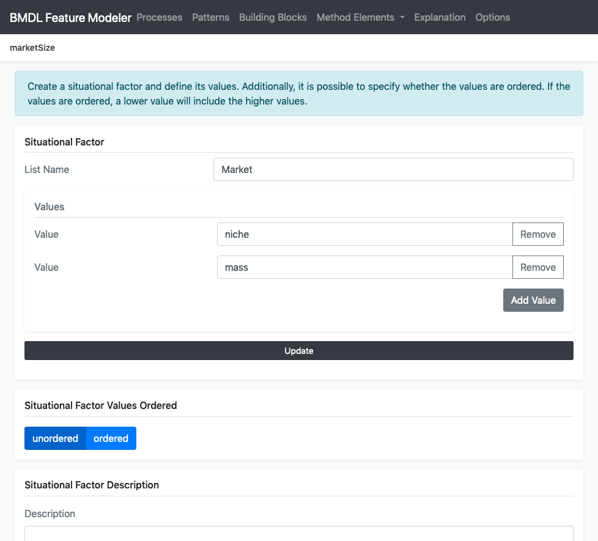
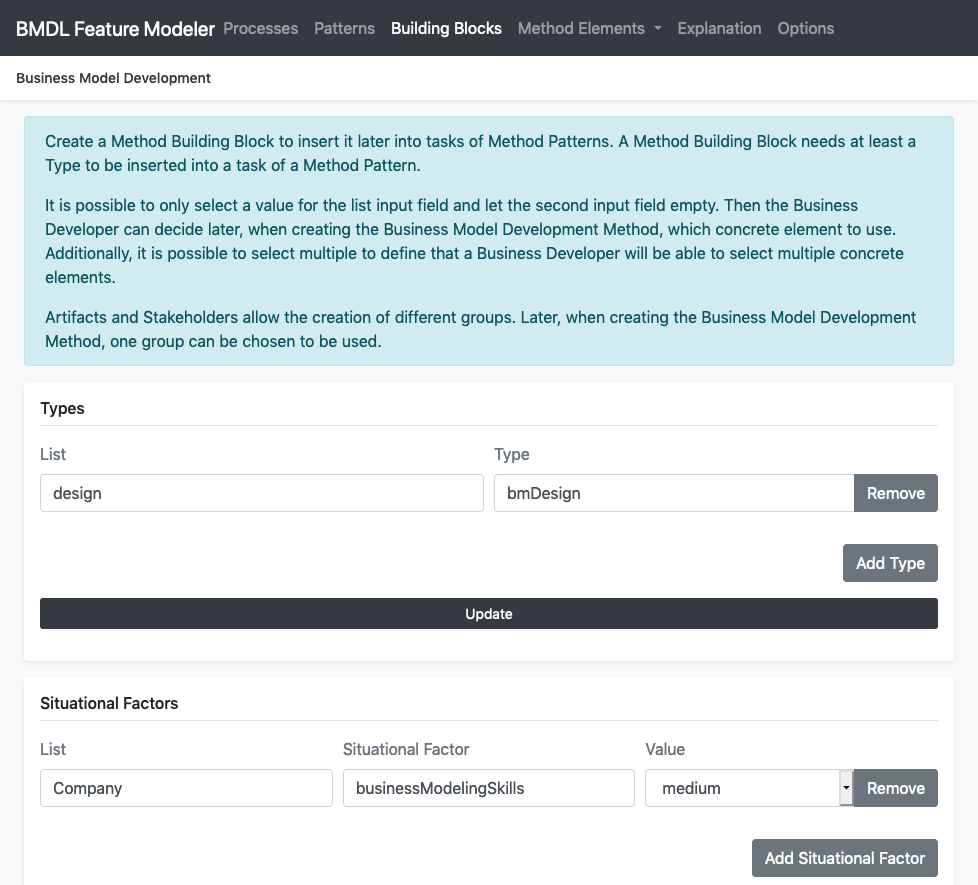
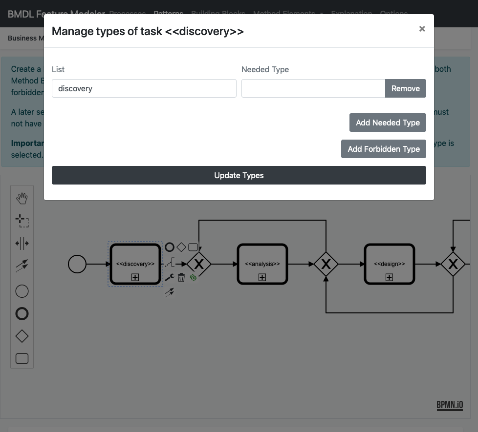
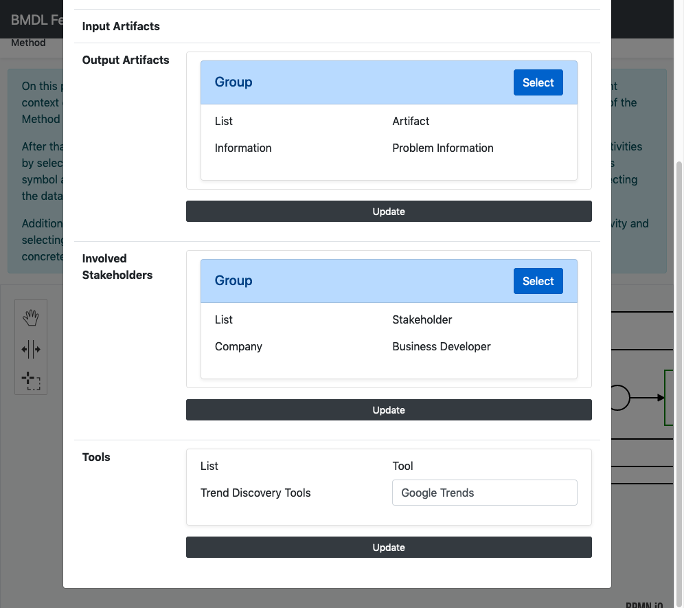

# BMDL Method Modeler
Describe Business Model Development Methods through Method Elements, Method Building Blocks and Method Patterns.

**Important**: This tool is not yet complete. It can contain bugs and some features are missing. This will be fixed until camera ready.

## Introduction
The BMDL Method Modeler is a tool to describe situation-specific Business Model Development Methods.
Business Model Development Methods can be described by combining Method Patterns and inserting
Method Building Blocks into them. Method Patterns and Method Building Blocks are constructed from
Method Elements. Method Elements are Artifacts, Situational Factors, Stakeholders, Tools and Types.
Types are special, as they are used to determine which Method Building Blocks or Method Patterns can be
inserted into activities of Method Patterns.

Additionally, Method Building Blocks allow to select abstract list types for input/output Artifacts,
Stakeholders and Tools. The user can later decide when developing the Business Model Development Methods,
which concrete Method Element to use, e.g. an expert selected the abstract list type Users for stakeholders and
the business developer can choose whether these are Customers, Experts or Early Adopters. Furthermore, the tool
allows to define that a user is later able
to select multiple instances of an abstract list type, e.g., in the example above, Customers and Experts.
It is also possible to select between different Groups of input artifacts, output artifacts and Stakeholders.
The tools is based on the [Angular framework](https://angular.io/), the [PouchDB database](https://pouchdb.com/) and [bpmn-js](https://bpmn.io/toolkit/bpmn-js/) to run directly in the webbrowser.
## Screenshots

| Create Method Elements | Create Method Building Blocks |
| ------ | ------ |
|  |  |

| Create Method Patterns | Create Business Model Development Methods |
| ------ | ------ |
|  |  |

## Installation

1. Install [NodeJS](https://nodejs.org) and [AngularCLI](https://cli.angular.io/) 
2. Clone BMDL Feature Modeler repository to your computer
3. Install all NPM packages with `npm install`
4. Configure database
    4.1. Internal database: By default the feature modeler is using PouchDB zu store data directly in the web storage of the browser. The database can be changed in `src/app/pouchdb.service.ts` within the variable `databaseName` (default: `bmdl-feature-modeler`)
    4.2. External database: The feature modeler allows also to use a CouchDB database as a persistent storage. For this, you need to change the `databaseName` in `src/app/pouchdb.service.ts` to `http://localhost:4200/database` and specify the url to the CouchDB in `proxy.conf.json` within the variable `target` (default: `http://localhost:5984/bmdl-modeler`)
5. Start service
    5.1. Internal database: Run the web application with `ng serve`
    5.2. External database: Run the web application with `npm start` to use the proxy for the external database
6. Have fun with the tool :)
## Further Information

- **Live Demonstration:** https://blindreviewconference.github.io/business-modeling-suite/
- **Research Paper:** Currently under review

## License
The BMDL Method Modeler is released under the MIT license.
